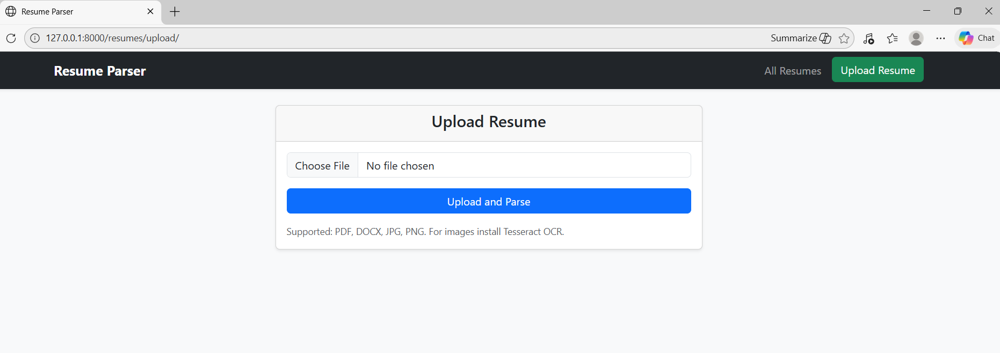
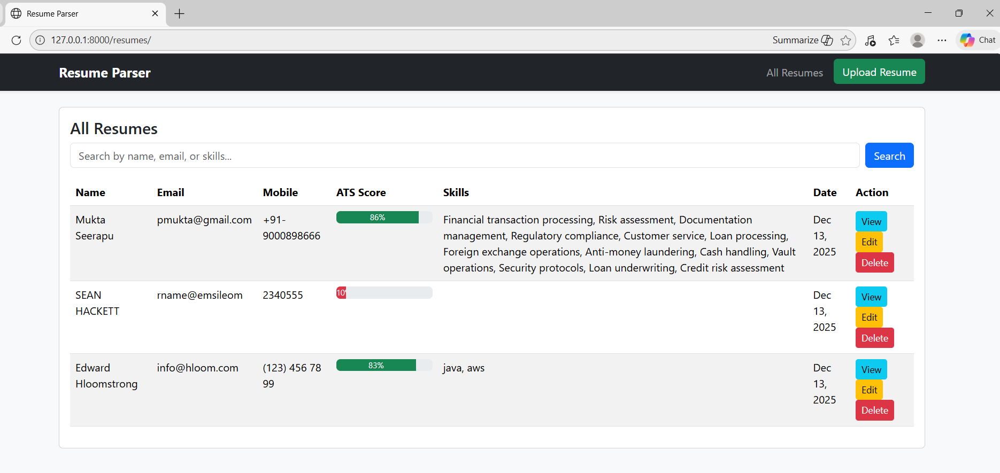
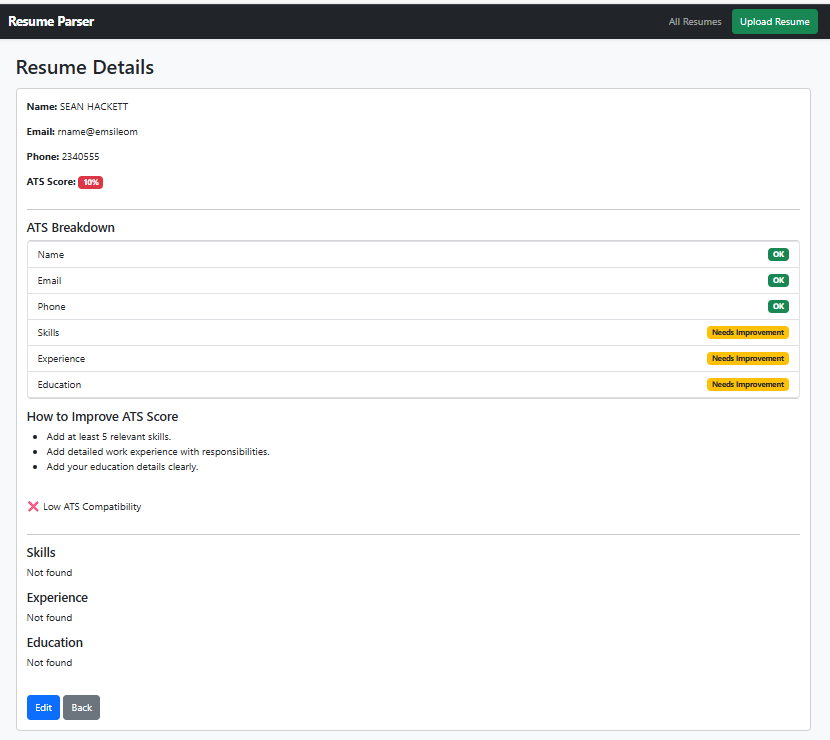
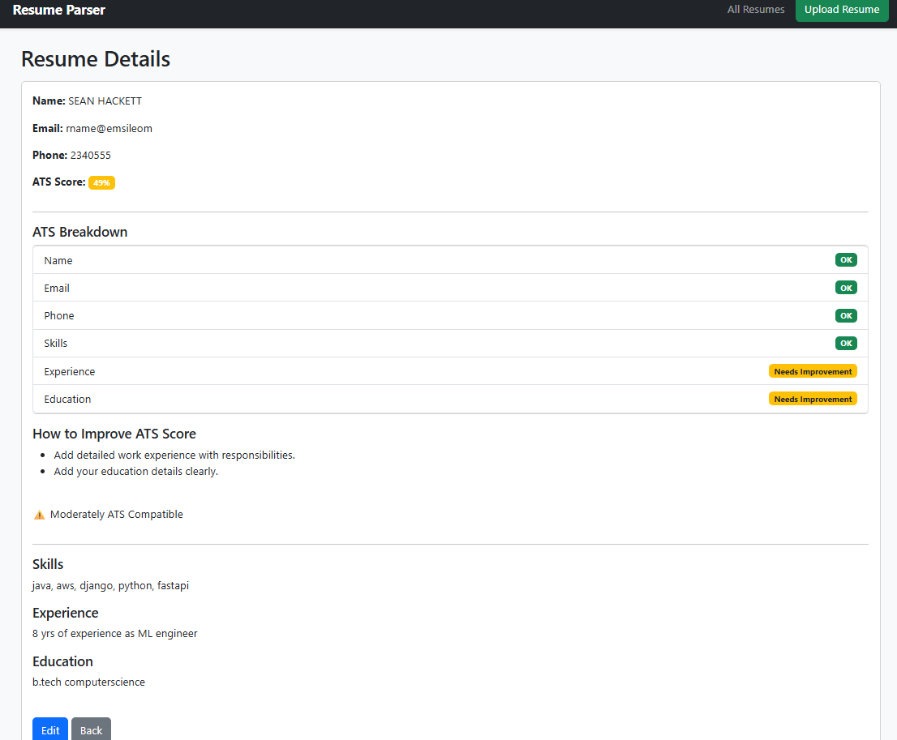

# Resume Parser & ATS Scoring System

A Django-based Resume Parser application that extracts resume data, calculates a realistic ATS (Applicant Tracking System) score, and provides actionable improvement suggestions.

This project simulates how modern ATS systems evaluate resumes using weighted scoring, OCR support, and optional LLM-based parsing.

---

## 🚀 Features

- Resume upload (PDF, DOCX, image-based resumes with OCR)
- Automatic extraction of:
  - Name
  - Email
  - Phone number
  - Skills
  - Experience
  - Education
- Editable resume profiles
- Realistic, weighted ATS scoring
- ATS breakdown with improvement suggestions
- Resume search and filtering
- Clean, responsive Bootstrap UI
- Secure API key handling using environment variables
- LLM parsing with safe local fallback (no crash if API key missing)

---

## 🛠 Tech Stack

- **Backend:** Python, Django
- **Frontend:** HTML, Bootstrap
- **Database:** SQLite
- **Resume Parsing:** PyPDF2, python-docx, pytesseract (OCR)
- **LLM Integration (Optional):** Groq API
- **Environment Management:** python-dotenv
- **Version Control:** Git & GitHub

---

## ⚙️ How to Run Locally

### 1️⃣ Clone the repository
git clone https://github.com/YOUR_USERNAME/resume-parser-ats.git
cd resume-parser-ats

### 2️⃣ Create and activate virtual environment
python -m venv venv
venv\Scripts\activate    # Windows

### 3️⃣ Install dependencies
pip install -r requirements.txt

### 4️⃣ Set environment variables

Create a .env file in the project root:

GROQ_API_KEY=your_api_key_here

The application works even without an API key using a local fallback parser.

### 5️⃣ Run database migrations
python manage.py migrate

### 6️⃣ Start the server
python manage.py runserver

Open your browser and go to:
http://127.0.0.1:8000/

---

## 🧠 ATS Scoring Logic (Realistic)

The ATS (Applicant Tracking System) score is calculated using a weighted, rule-based approach to avoid inflated scores and better simulate real-world ATS behavior.

### Scoring Weights

| Resume Section | Weight |
|---------------|--------|
| Name          | 10%    |
| Email         | 10%    |
| Phone Number | 10%    |
| Skills        | 25%    |
| Experience    | 25%    |
| Education     | 20%    |

### Key Characteristics
- Short or weak sections receive partial or zero points
- Detailed experience and education are rewarded
- Scores rarely reach 100% to maintain realism
- ATS breakdown highlights missing or weak sections

---

## 📸 Screenshots

### 1️⃣ Upload Resume

---

### 2️⃣ All Resumes List with ATS Scores

---

### 3️⃣ Resume Details & ATS Breakdown

---

### 4️⃣ Edit Resume

---

### 5️⃣ ATS Score Improvement After Edit

- ---

